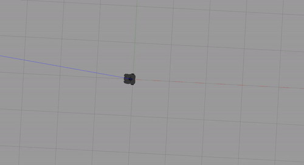
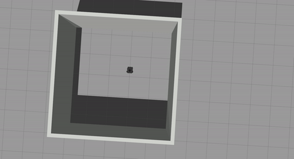

# Warmup Project

## Driving in a Square

The problem consisted in getting the Turtlebot to drive in a square. To solve
this problem, I split it into two separate parts: driving in a straight line and
turning.

### Driving in a straight line

For each of the sides of the square, we want the Turtlebot to drive in a 
straight line. At the beginning and at the end of each straight path, the
Turtlebot must be at a stopped position. Thus, I split this task into three
different components: an acceleration phase, a constant velocity phase, and
a slow down phase. 
During the first few seconds of driving, the Turtlebot is
speeding up until it reaches the desired final velocity (0.3 m/s). Then, it
drives at this velocity for 3 seconds. Finally, it slows down to a halt in the
last phase. 

Both the acceleration and slow down phases, as well as the slow final velocity
were used as a way to mitigate drift from real world noise, which was more 
significant with higher velocities and bigger changes in velocity.

### Turning

Once the Turtlebot has reached the end of the straight line phase, we want it to
turn 90°, and begin driving in a straight line again. This task is 
divided in two phases: an acceleration phase and a slow down phase. From 0° to 
45° the angular velocity of the Turtlebot constantly increases, and from 45° to
90° the velocity decreases to 0. This was done to mitigate noise and have a more 
accurate turn, within a relatively short timeframe. Setting a constant high 
speed could lead to overshooting the 90° (due to time constraints of ROS
or due to the time it takes for the Turtlebot to slow down), and a constant low 
speed would make it take too long for the Turtlebot to turn. 

### Code Structure

The code is wrapped in a class called `SquareDriver`. The class contains the 
following functions:

- `__init__(self)`: initializes the ROS node, creates a publisher to publish to
the `/cmd_vel` topic and a subscriber to the `/cmd_vel` topic (for debugging 
purposes)
- `_process_speed(self, data)`: callback function for the subscriber created in
the `__init__` function. Prints out the `data`.
- `_drive_in_a_straight_line(self)`: handles the logic for driving in a straight 
line as explained [above](###driving-in-a-straight-line). The function contains
three loops one for each of the three phases. Each of the phases takes the same 
time, and values for acceleration are found using the desired maximum velocity,
the time we want the Turtlebot to move forward, and how often will the speed be
changed.
- `_turn(self)`: this function handles the turn logic as described
[above](###turning). The function consists of two loops one for the acceleration
phase and one for the slow down phase. The acceleration rate is found using 
simple kinematics based on the desired angle of 90°, the time we want the turn 
to take, and how often will the speed be changed.
- `_do_one_loop(self)`: completes one side of the square, that is, it drives in
a straight line for the length of the side of the square, and then turns to the
direction of the next side of the square. Essentially it calls the 
`_drive_in_a_straight_line` and `_turn` functions. After each call, ROS sleeps 
for one second to ensure that the Turtlebot has stopped completely before 
proceeding to the next action.
- `run(self)`: runs `_do_one_loop` endlessly for as long as ROS is running.

Thus, to run the code, all we need is the line `SquareDriver.run()`.

### Demo

The following GIF shows the code in action. As we can see, we are able to drive
in a square with little error, as we are able to reach the starting position.

## Wall Follower

The problem consisted in getting the Turtlebot to, once they reach a wall, drive
alongside it at a somewhat constant distance. Additionally, if the Turtlebot 
encounters a corner, it should be able to turn and keep following the wall in
the new direction. To solve this, first the Turtlebot navigates in a straight 
line until it gets close to a wall. Then, I use the LIDAR data from the 
Turtlebot to determine at which angle is the closest wall. I then attempt to 
keep this angle to be exactly or close to 270°. This means that the closest wall
will be to the right of the Turtlebot at all times. I do this by making the 
Turtlebot turn clockwise when the angle to the closest wall is below 260°, and 
turn counterclockwise when the angle is above 280°. This helps keep the 
Turtlebot from drifting too far from the wall, and helps it handle turns.

### Code Structure

The code is wrapped in a class called `WallFollower`. The class contains the 
following functions:

- `__init__(self)`: initializes the ROS node, creates a publisher to publish to
the `/cmd_vel` topic and a subscriber to the `/scan` topic to get LIDAR data.
- `_process_scan(self, data)`: receives data from the LIDAR scan and processes
it to handle driving along the wall as described [above](##wall-follower). While 
the Turtlebot has not gotten close enough to a wall, it keeps driving straight. 
Otherwise, it keeps driving straight if it is going parallel to a wall, or 
adjusts the direction if needed (including for handling corners).
- `run(self)`: calls `rospy.spin()`.

Thus, to run the code, all we need is the line `WallFollower.run()`.

### Demo

The following GIF shows the code in action. As we can see, we are able to drive
in a square with little error, as we are able to reach the starting position.

## Person Follower

The problem consisted in getting the Turtlebot to follow a person or object. To 
solve this problem, I use the LIDAR data from the Turtlebot to determine the 
location of the closest object. If the Turtlebot is not facing this object, then
it turns so toward its direction, if the object is farther away than 1m, the 
Turtlebot also move forward (potentially as it turns) to approach the object, 
and if there are no objects close enough (within a ~3.5m radius), the Turtlebot 
does not move at all.

### Code Structure

The code is wrapped in a class called `PersonFollower`. The class contains the 
following functions:

- `__init__(self)`: initializes the ROS node, creates a publisher to publish to
the `/cmd_vel` topic and a subscriber to the `/scan` topic to get LIDAR data.
- `_process_scan(self, data)`: receives data from the LIDAR scan and processes 
it so that the Turtlebot follows its closest object as described
[above](##person-follower). The direction for the turn is determined based on 
the angle: counterclockwise for 180 or less, clockwise otherwise.
- `run(self)`: calls `rospy.spin()`.

Thus, to run the code, all we need is the line `PersonFollower.run()`.

### Demo

The following GIF shows the code in action. As we can see, we are able to drive
in a square with little error, as we are able to reach the starting position.

